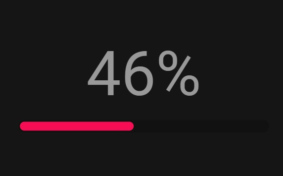

# Barra-de-Carga-Porcentaje
animación de una barra de carga con efecto de porcentaje hecha en HTML, CSS y JS

  
    
  
    
  
  

## ¿Cuál es el fin de este proyecto?
Este proyecto se creó con fines de aprendizaje usando HTML, CSS y JavaScript. 

## ¿Puedo Probarlo en Linea? 
Si, Puedes probarlo en linea haciendo click [aqui](https://carlosorellana00.github.io/Barra-de-Carga-Porcentaje/)

## Capturas de Pantallas
 vistas de ejemplo
 
 

  

  

  

